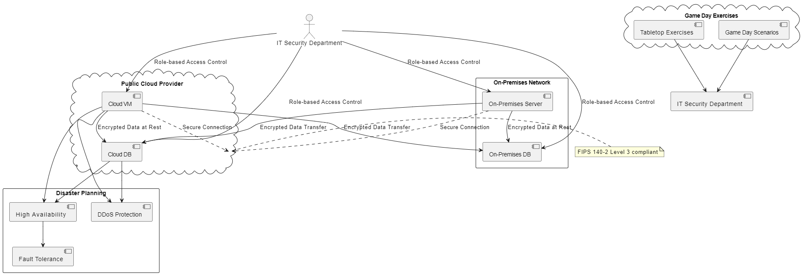
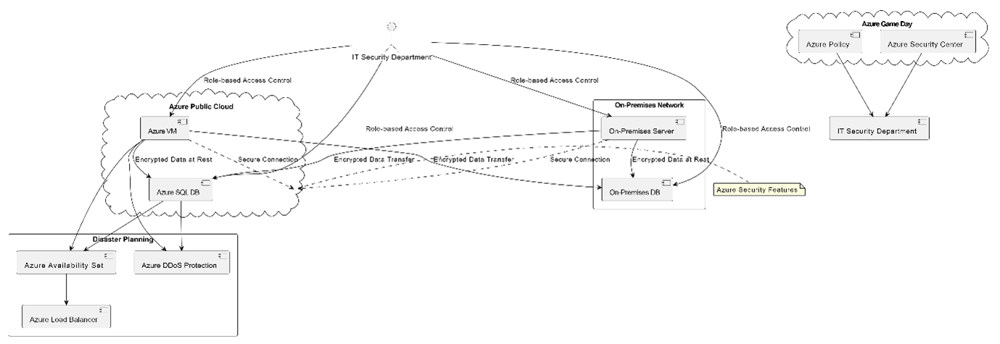
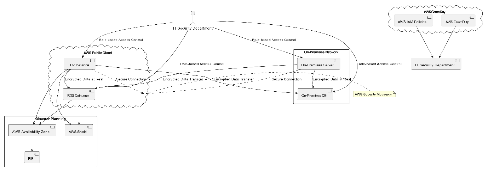

# cloud-and-on-premise-security-plan
<b>A case study to develop a cloud and on-premise security plan.</b>  
A client’s consists of both on-premise functionality as well as public cloud solutions, we needed to ensure that security is at the forefront on the design. 
As an accounting company, they must ensure that it complies to all financial regulations, together with satisfying all GDPR policies – especially around the storage and security of customer’s data. 
It is stipulated that all customer data around financial records must be kept for a minimum of 10 years, as before - with enterprise customers (companies of more than 5,000 employees) data being retained for a minimum of 15 years. 
With security in mind, our manager has asked me to make a thorough investigation of our client’s existing on-premise and cloud-based architecture.  My recommendations on how the networks can be improved made me consider the following: 
•	Security of on-premise network environment, cloud environment, and connections between the two. All data at rest and in transit should be secured to at least 256-bit length. 
•	A secure strategy for data transfer, though this needs to accommodate both ‘connected/on-line’ and ‘off-line’ transfer. 
•	Adoption of current on-premise security around key management into the cloud. The on-premises and cloud solution must meet FIPS 140-2 Level 3 compliance. 
•	A Role Based Access Control strategy for your chosen cloud solution offering designated permission to the following roles for members of the IT Security department (preferably with pre-defined permissions): 
&nbsp;o	Storage 
&nbsp;o	Database Management 
&nbsp;o	Security 
&nbsp;o	Auditing 
&nbsp;o	VM management 
•	Disaster planning including High Availability/Fault Tolerance. 
•	Recommendations on ‘Tabletop’ or ‘Game Day exercises’. 
•	Distributed Denial of Service (DDoS) attack protection for any solutions migrated to your cloud provider of choice. 
 
<b>My Solution</b>  

 
<b>Azure</b>  

 
<b>AWS</b>  

 
